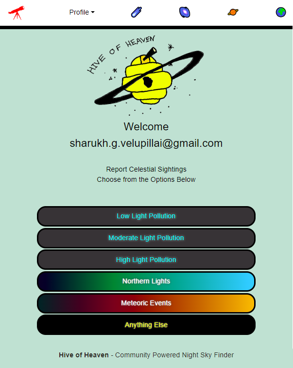
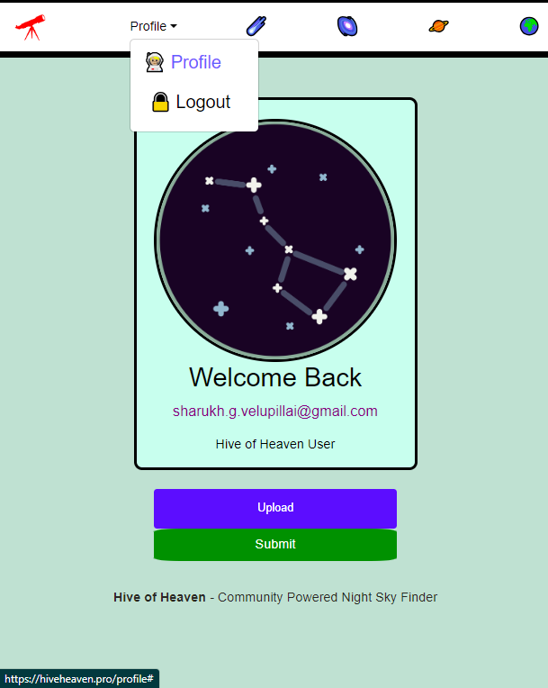
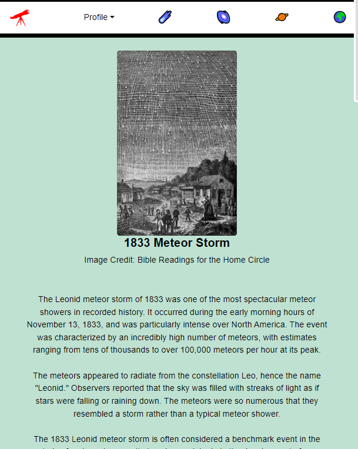
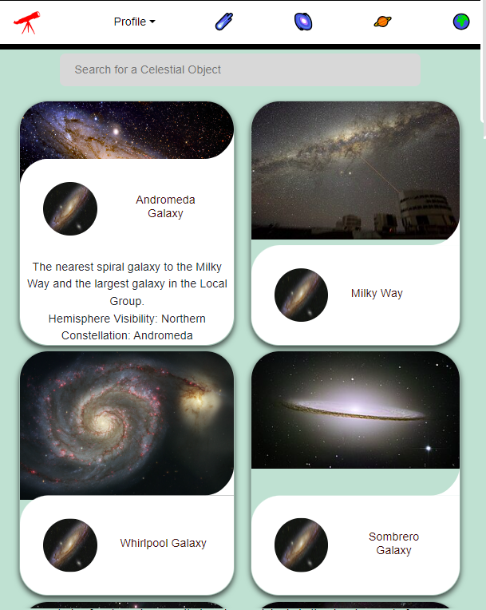
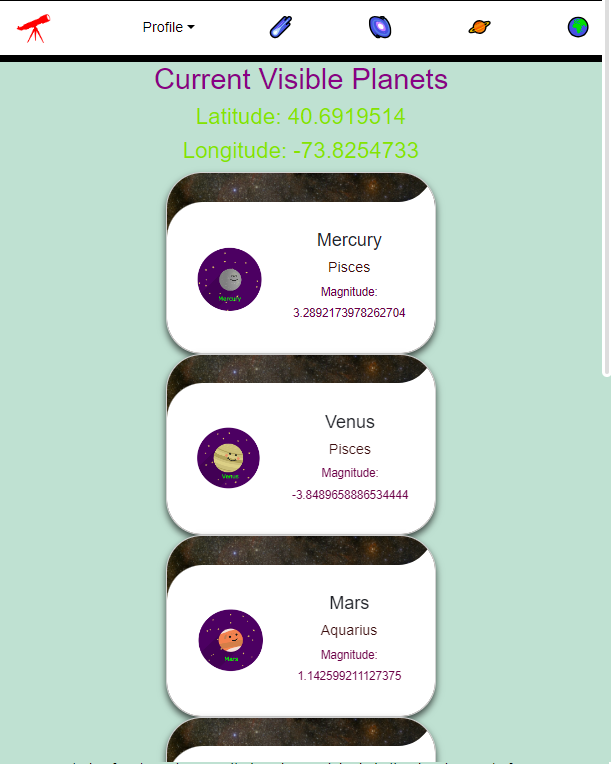
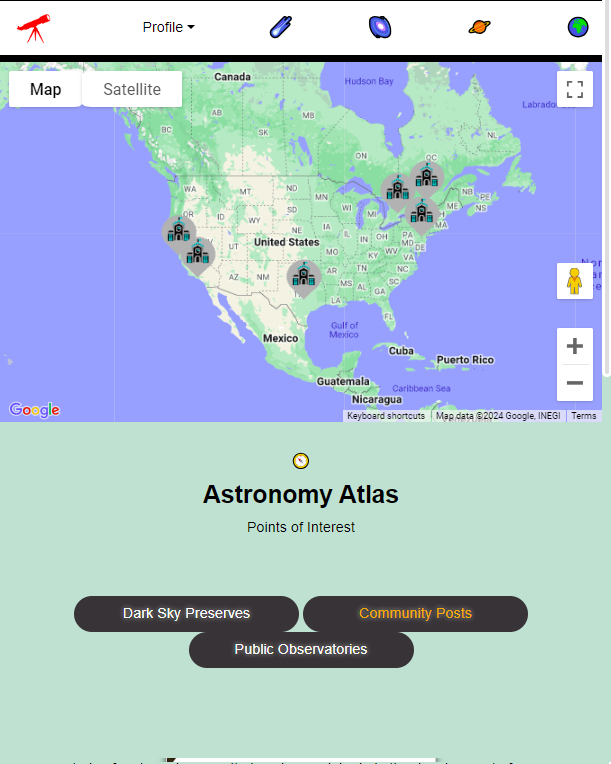
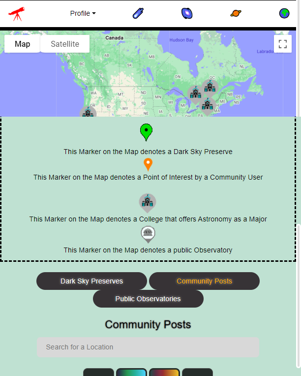
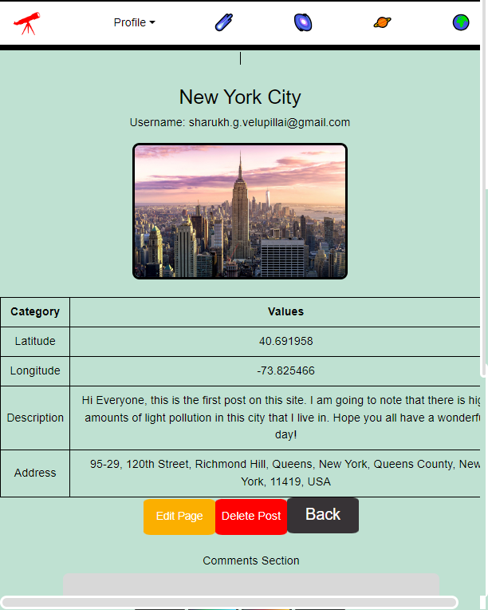

# Hive of Heaven
## Community Night Sky Finder

A community powered app where users may
create a post on light-polluted areas or dark skies
with geolocation tags. This is so others can be
better informed if travelling to see the beauty of
the night sky. Almost 80% of the world's
populations cannot see the Milky Way band, and
such beauty being hidden is truly a catastrophe!

Future Features include Planets API checklist, and upvoting posts.

## Home Page of App

Includes modals with descriptions for specific types of posts. Users can click on a button, then a modal will pop up. Users may choose to cancel the modal or be prompted to create a post based on the button pressed.

## Create Page
Users can upload an image and write about their celestial sightings. 

Technologies used: Cloudinary

## Profile Page
Users may upload their profile picture here.

Technologies used: Cloudinary

## Meteor Shower Page
Users can view the visible annual meteor showers and read about a spectacle in the past.

## Galaxies & Celestial Objects Page
Users may search for a celestial object or scroll to see the different ones displayed.

## Visible Planets (Location Based from API) Page
Based on a user's geolocation, the visible planets will be showed here.

Technologies used: Visible Planets API

## Astronomy Atlas Page Page
Various Points of Interest can be viewed on this page, including community posts. Community posts are organized into four main categories. 

Technologies used: Google Maps API

## Legend on Atlas Page
The legend shows what markers mean on the map

## Individual Post Page
An indiviudal user's post, with delete and edit functionality. Commenting is also available for all users to comment on the specific post.

Technologies used: Location IQ API, Cloudinary

Here is the Link to the Site: [Hive of Heaven]
(https://hiveheaven.pro/)

