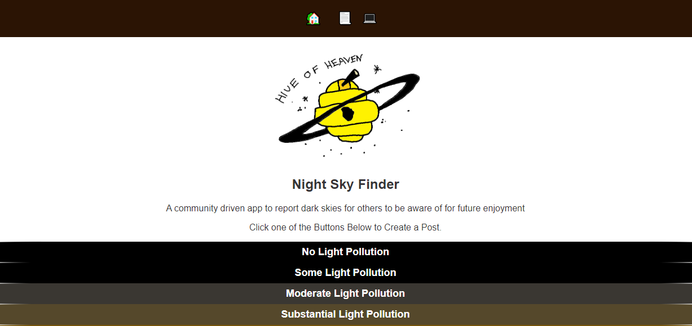
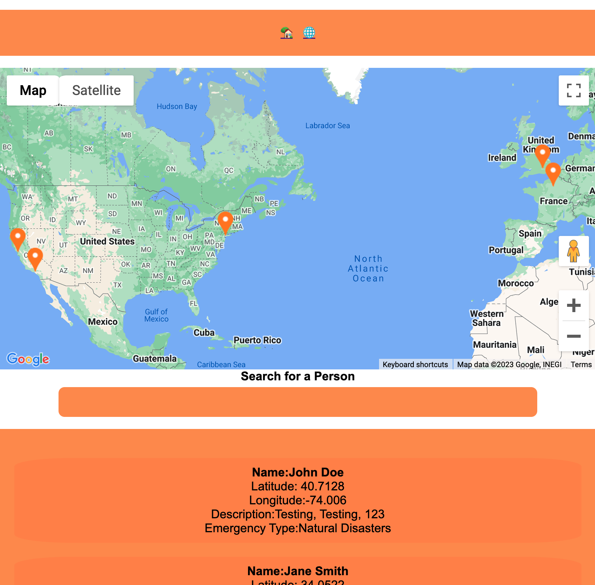

# Hive of Heaven
## Community Night Sky Finder

A community powered app where users may
create a post on light-polluted areas or dark skies
with geolocation tags. This is so others can be
better informed if travelling to see the beauty of
the night sky. Almost 80% of the world's
populations cannot see the Milky Way band, and
such beauty being hidden is truly a catastrophe!

Future Features include File Upload, comments on
posts, Planets API checklist, and upvoting posts.

## Home Page of App

## Map Index Page

Here is the Link to the Site: [Hive of Heaven](https://hiveheaven.pro/)

